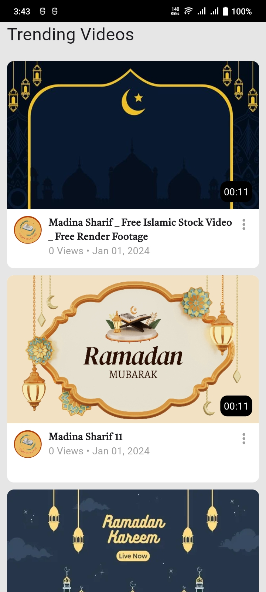

# QTec Task Documentation

## Project Overview
    - MVC Pattern
    - Provider Statemanagement
    - Api Data Model
    - Readable

## Home Page
    - Landing Page
    - All Trending Videos Are Appeared Here
    - Video With Duratiion, Video Thumbnail, Channel Logo, Video Title, Total View and Upload Time
    - Loading While Data Fetching 
    - If Anything Wrong It Will Give a Message 'Something Went Wrong'
    - Image Below

## Video Player Page
    - Video Player With Flutter video_player Package
    - Auto Play Video
    - No Controls
    - Video Title
    - Video Total Views
    - Upload Time
    - Favorite Button (MASH ALLAH Button) Without Implement Tap Event
    - Like Button Without Implement Tap Event
    - Share Button Without Implement Tap Event
    - Report Button Without Implement Tap Event
    - Channel Logo with Total Subscirber and a Subscribe Button
    - Total Comments
    - Comment Area
    - Comment Preview
    - Loding Widget
    - Image Below

### Note: Provider is implemented but not used anywhere